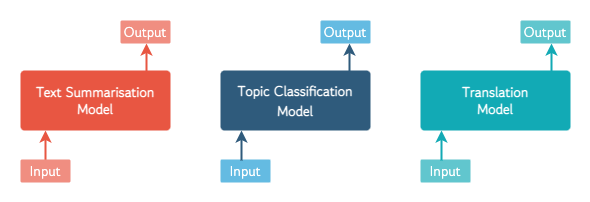
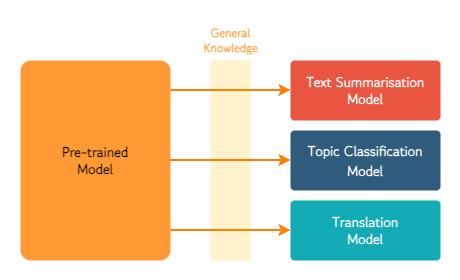
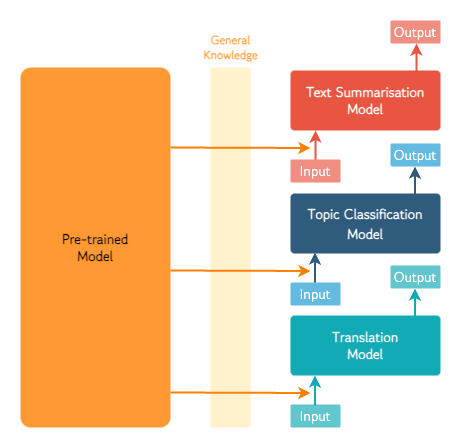
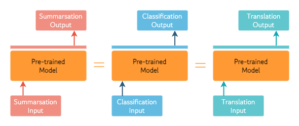

# 1. Intro

최근에 KoLIMA라는 사이드 프로젝트를 하나 시작했습니다. 2023년 5월에 Meta AI에서 발표한 [LIMA: Less Is More for Alignment](https://arxiv.org/abs/2305.11206)라는 모형에서 사용한 방법론이 한국어 언어 모형에도 적용 가능한지 확인해보고자 하는 목적에서 진행하는 프로젝트입니다.

## 1.1 LIMA and KoLIMA

우선 LIMA는, 소규모의 엄선된 instruction dataset 만으로도 pre-training objective와 final objective 사이의 mismatch를 충분히 align 할 수 있다는 내용을 다루고 있습니다.

우리가 언어 모형을 연구하고 개발하는 이유는 무엇일까요? 다르게 표현하자면, 사람들이 언어 모형에게 기대하는 바는 무엇일까요? 아마도 우리는 언어 모형이 우리의 요청에 따라 질문에 올바르게 답변하고, 번역이나 요약 등의 요청도 적절히 수행하기를 바랄 것입니다. 즉, 우리가 언어 모형을 학습시키는 최종 목적은 '언어 모형*Language Model*이 입력값*Input*으로 주어지는 사람의 지시*Instruction*을 따르게 하는 것'이라고 할 수 있습니다. 한편, 우리가 이미 살펴보았듯이 언어 모형의 사전 학습*Pre-training* 단계에서의 학습 목표는 'Masked/Causal Language Modelling의 Loss의 최소화'입니다. 따라서, '우리의 최종 목표와 언어 모형의 훈련 단계에서의 학습 목표 사이에는 Mismatch(혹은 Gap)가 존재하는데, 이러한 상이한 학습 목표를 어떻게 Align 할 수 있을까?'라는 자연스러운 질문은 최근 NLP 분야에서 많은 관심을 받아온 연구 주제입니다. 예를 들자면, ChatGPT의 전신이자 Sibling 모형인 InstructGPT도 해당 문제를 다루고 있고, LLaMA 모형에 (Self-instruct를 활용하여 생성한 Instruction dataset을 통해) Instruction-tuning을 적용한 Stanford Alpaca도 동일한 주제에 관심을 집중하고 있습니다.

많은 분들이 아시다시피, ChatGPT 훈련 과정의 핵심은 RLHF를 통해 Human Feedback을 학습 과정에 반영하는 것이지만, 해당 프로세스는 꽤 높은 비용을 필요로 합니다. 물론 OpenAI도 RLHF를 최대한 자동화된 프로세스로 만들기 위해서 노력하긴 했습니다. Human Feedback을 예측하는 모형을 별도로 훈련시켜서 활용하는 구조로 구성했기 때문에, 일정 시점 이후부터는 사람이 언어 모형의 아웃풋에 대한 Feedback을 직접 Annotation 할 필요성이 줄어들긴 합니다. 그럼에도 불구하고 RLHF는 전체적으로 고비용의 프로세스일 수 밖에 없을 뿐더러, OpenAI가 학습에 사용한 데이터셋을 공개하지 않았기 때문에 데이터와 모형의 재활용을 통한 비용 절감 또한 기대하기 어려운 상황이죠.

개인적으로 생각하기에, LIMA는 '그게... 그렇게까지 할 일인가?'라는 질문에서부터 출발했던 것 같습니다. [(Xie et al., 2021)](https://arxiv.org/abs/2111.02080)과 [(Ahuja et al., 2023)](https://arxiv.org/abs/2306.04891)을 비롯한 여러 논문들의 실험 결과가 암시하듯이, In-context learning ability를 비롯한 거대 언어 모형의 대부분의 지식은 이미 사전 학습 단계에서 학습된 것이며, instruction-tuning은 단지 사람과 언어 모형이 상호 작용하는 방식을 학습하는 간단한 과정일 가능성이 높습니다. 따라서 'RLHF처럼 복잡한 과정 없이도, 1k 규모의 엄선된 instruction dataset만으로도 만족할만한 성능의 alignment를 수행할 수 있다'라는 내용이 LIMA의 저자들이 주장하고자 했던 핵심적인 내용입니다.

앞서 언급했듯이, KoLIMA는 LIMA의 저자들이 주장하는 내용이 한국어 언어 모형에서도 동일하게 적용되는지 확인해보기 위한 프로젝트입니다. 조금 더 구체적으로는, 아래 두 가지의 항목에 대해 살펴보는 것을 목적으로 합니다.

- 영어와 한국어의 언어적 특성에 따른 instruction-tuning의 효과 차이
- 영어로 작성된 instruction dataset을 기계 번역을 통해 한국어로 변환하는 과정에서 필연적으로 발생하는 noise(번역 오류 등)에 대한 강건성

이를 위해, 우선 LIMA dataset을 DeepL API를 활용하여 한국어로 번역한 KoLIMA dataset을 생성하고, 사전 학습된 한국어 언어 모형인 Polyglot-ko을 백본 모형으로 instruction-tuning을 적용하여 모형의 성능을 평가해보고자 합니다. 현재 데이터셋의 번역은 완료된 상태이고, Polyglot-ko 1.3B, 3.8B 모형의 학습에 이어서 5.8B, 12.B 모형의 학습을 진행 중에 있습니다.

## 1.2 This Article Covers:

이번 글에서는 지금까지 언급했던 내용들인 pre-training, fine-tuning, instruction-tuning, transfer learning 등의 개념을 이해하기 위한 배경 지식에 대해 다룹니다. 이전 글들에서 다루었던 CNNs, RNNs, Transformers 등의 개념이 LM을 구성하는 아키텍쳐 측면에서의 구성 요소였다면, 이번 글에서는 LM을 '어떻게 학습시킬 것인가'에 대한 내용을 다룹니다. 다시 말해, 최근 몇 년간의 NLP 분야에서의 연구 트랜드를 Learning Framework의 관점에서 정리해보도록 하겠습니다. 또한, 이 글은 [Lena Voita](https://lena-voita.github.io/nlp_course/transfer_learning.html)와 [Sebastian Ruder](https://www.ruder.io/state-of-transfer-learning-in-nlp/)의 블로그를 참고하고, 많은 영감을 받았음을 밝힙니다.

# 2. Learning Frameworks in NLP

## 2.1 Supervised Learning with Task-specific Models

머신러닝을 공부하기 시작하면 가장 먼저 배우게 되는 개념들 중 하나가 바로 지도 학습과 비지도 학습에 대한 내용입니다. 지도 학습은 레이블이 붙어있는 학습 데이터셋을 활용하여 모형이 특정 Task를 수행하는 방법을 가르치는 훈련 방법이죠. 그리고 얼마 전까지만해도 대부분의 NLP Task들은 해당 Task를 수행하기 위한 구체적인 모형이 있고, 해당 모형에 지도 학습 적용하여 훈련시키는 방법을 사용했었습니다. 예를 들어, 텍스트 요약, 주제 분류, 번역과 같은 3개의 구체적인 task가 있다고 할 때, 각각의 task를 위한 세 개의 모형이 별도로 존재하는 형태였죠. 그림으로 표현해보자면 다음과 같습니다.

## 2.2 Pre-trained Model for General Knowledge

<!-- Pre-trained Models as an Auxiliary Model -->

그런데, 텍스트 요약과, 주제 분류, 번역이라는 세 가지 Task를 잘 하기 위해서 필요한 공통적인 지식이 있을 수 있지 않을까요? 예를 들어, 한국어를 할 줄 모르는 사람에게 한글로된 뉴스 기사를 요약하고, 주제를 분류하고, 영어로 번역하는 것을 가르치는 것보다, 한국어를 이미 알고 있는 사람에게 동일한 내용을 가르치는 것이 훨씬 더 효율적일 것입니다. 이렇게 특정 Task *Specific Task*에 관계없이 일반적으로 활용될 수 있는 언어에 대한 지식을 일반 지식*General Knowledge*이라고 하고, 여기에는 개별 단어의 의미, 품사, 문장 내에서의 역할, 문법 구조 등이 포함됩니다. 이러한 일반 지식은 레이블이 필요하지 않은 비지도 학습 기법을 통해서도 학습시킬 수 있다는 사실이 선행 연구들을 통해 알려져있고, 특정 Task를 위한 레이블링이 되어 있지 않은 대량의 텍스트 데이터를 통해 이러한 일반 지식을 학습시킨 모형을 우리는 사전 학습 모형*Pre-trained Model*이라고 부릅니다. 사전 학습 모형의 일반 지식이 각각의 Task를 위한 모형*Task-specific Models*에서 활용되는 구조를 그림으로 나타내면 다음과 같습니다.

그렇다면, 이러한 일반 지식을 어떤 형태로 개별 모형들에게 전달할 수 있을까요? 가장 일반적인 방법은 단어 임베딩*Word Embeddings*에 이러한 정보들을 담아 개별 모형의 입력값으로 활용하는 것입니다. 혹은 [지난 글](https://taes.me/Knowledge%20Integration%20in%20Language%20Model/)에서 살펴봤던 것처럼 개체 임베딩*Entity Embeddings*을 활용할 수도 있습니다. 이러한 임베딩을 생성하기 위한 다양한 방법들이 연구되어 왔으며, 대표적으로는 word2vec, ELMo, BERT 등이 있습니다.

각각의 방법론이 어떤 특징을 지니고 있는지 간략히 살펴보고, Learning Framework의 관점에서 어떤 방식으로 활용되는지 다시 한 번 정리해보도록 하겠습니다.

### 2.2.1 Era of Kings and Queens: Static Embeddings

이번 섹션의 소제목인 '왕과 여왕들의 시대 *Era of Kings and Queens*'는 많은 분들께 익숙할 `vector(King) - vector(Man) + vector(Woman) = vector(queen)`의 예시로부터 가져왔습니다. 해당 예시는 word2vec을 제안했던 Tomas Mikolov의 논문에서 처음 등장했으며, word2vec은 '함께 등장하는 단어 집합이 유사한 단어들은 서로 비슷한 의미를 지닌다'라는 간단한 가정을 기반으로 단어를 수치 벡터로 표현하는 방법입니다. (Mikolov et al., 2013)은 CBOW 혹은 Skip-gram이라는 방법을 통해 동시 발생 빈도를 기반으로 각 단어의 의미를 연속 공간*Continuous Space*에 표현하고, 이러한 단어 벡터(임베딩)가 단어들 간의 관계를 일정 수준에서 포착*Capture*할 수 있다는 사실을 보였습니다. 그 이후로도 단어의 의미를 연속 공간에서 표현하기 위한 많은 연구가 이루어졌으며, Winodw size로 인한 한계를 보완하기 위한 방법인 Glove (Pennington et al., 2014)와 Subword의 개념을 활용한 FastText (Bojanowski et al., 2016) 등이 추가로 제안되었습니다.

다만 word2vec을 비롯한 이러한 방법론들은 주변에 함께 등장한 단어를 고려하지 못하고, 하나의 단어에 문맥에 관계없이 고정된 하나의 임베딩만을 할당한다는 단점이 있습니다. 다시 말해, word2vec을 통해 생성한 임베딩을 통해서는 [이 글](https://taes.me/Dependency%20in%20Languages/)에서 다루었던 여러 의미를 지닐 수 있는 '배'를 각각 다르게 표현할 수 없다는 한계를 지닙니다. 우리는 이러한 특징을 지니는 임베딩을 다음 장에서 살펴볼 동적 임베딩*Contextualised/Dynamic Embeddings*과 구분하는 의미에서 정적 임베딩*Static Embeddings*이라고 부릅니다.

### 2.2.2 ELMo: Contextualised Word Embeddings

ELMo는 이러한 정적 임베딩의 단점을 개선한 동적 임베딩*dynamic embeddings*을 생성하는 방법론입니다. 주변 문맥을 반영한 임베딩이라는 의미에서 문맥 임베딩*contextualised embeddings*라고 표현하기도 합니다. 여기서 '동적'이라는 표현은 주변에 등장한 단어(문맥*Context*)에 따라서 임베딩이 표현하는 단어의 의미가 변화한다는 특징을 나타내기 위한 표현입니다. 아래의 Lena Voita의 Figure를 통해, 동적 임베딩이 정적 임베딩으로부터 어떤 점이 다른지 살펴보도록 하겠습니다.

Figure의 좌측은 정적 임베딩을 나타내고 있습니다. 정적 임베딩에서 'cat'이라는 단어는 주변에 함께 등장한 단어들과 관계없이 항상 동일한 수치 표현(벡터)를 갖습니다. flying cat의 cat도, the cat on the mat의 cat도, the cat by the door의 cat도 모두 동일한 수치 벡터로 표현됩니다. 한편, ELMo (Peters et al., 2018)를 비롯한 동적 임베딩 기법에서는 각각의 cat을 주변 맥락*Context*을 고려한 임베딩으로 표현할 수 있습니다. 다시 말해, 앞선 예시의 서로 다른 세 구문에서의 cat은 모두 다른 수치 벡터로 표현됩니다. 이러한 동적 임베딩은 주변 맥락에 따라 달라지는 의미를 표현할 수 있을 뿐만 아니라, 동음이의어와 같이 하나의 단어가 여러 의미를 지니는 현상을 다루기에도 적합한 방법론이라고 할 수 있습니다.

### 2.2.3 Pre-trained Embeddings as an Input for Task-specific Models

지금까지 살펴본 것처럼, 정적 임베딩을 생성하는 word2vec, GloVe, FastText 등의 방법론과 동적 임베딩을 생성하는 ELMo는 단어를 표현할 때 주변 맥락을 고려할 수 있는지 없는지에 따른 차이가 있긴 하지만, 생성된 임베딩이 최종 Task를 위해 활용되는 방법에 있어서는 차이가 없습니다. 다시 말해, 아래 그림에서 살펴볼 수 있는 것처럼 사전 학습 모형은 단어 집합을 입력으로 받아 각각의 단어에 대한 임베딩을 생성하고, 이는 다시 개별 Task를 위한 모형*Task-specific Model*의 입력값으로 활용됩니다.

이러한 관점에서, 우리가 최종적으로 수행하고자 하는 작업을 위한 개별 모형을 메인 모형*Main Model*, 메인 모형에서 활용하기 위한 일반 지식을 전달하기 위한 사전 학습 모형을 보조 모형*Auxiliary Model*이라고 부르기도 합니다. 그리고 각각의 작업을 위한 개별 모형을 메인 모형으로 보는 이러한 관점은 GPT-2와 BERT를 기점으로 크게 변화하게 되는데, 다음 절에서는 이러한 관점 변화에 대해서 살펴보도록 하겠습니다.

## 2.3 Universal Models 

<!-- Pre-trained Models as an Universal Model -->

### 2.3.1 Universal Models with Contextualised Embeddings

BERT (Devlin et al., 2019)는 이전 절에서 살펴본 ELMo와 마찬가지로 각 단어에 대한 동적 임베딩을 생성하는 모형입니다. 그러나 이번 절에서 우리가 주목할 부분은 BERT가 Task를 수행하기 위해 활용되는 방법입니다. 결론부터 이야기하자면, BERT는 단일 모형으로 여러 Task를 수행할 수 있는 범용 모형*Universal/Foundational Model*입니다.

각각의 Task를 위한 task-specific model이 별도로 존재하고 사전 학습 모형으로부터 생성된 임베딩은 해당 모형의 입력으로 활용되던 기존의 프레임워크와 달리, BERT를 제안한 Devlin et al.은 질의응답*Question Answering*, 시퀀스 태깅*Sequential Tagging*, 문장 혹은 문장쌍 분류*Sentence (Pair) Classification* 등의 다양한 task를 수행하기 위해 별도의 모형을 사용하지 않았습니다. 대신, BERT로부터 생성된 임베딩 위에 존재하는 최상단 레이어만 교체해가면서 여러 Task를 수행하는 것만으로도, 기존의 각각의 모형들보다 개선된 성능을 확보할 수 있다는 사실을 보였죠. 이러한 구조를 그림으로 표현하자면 다음과 같습니다. 더 이상 각각의 Task를 위한 개별 모형이 존재하지 않고, 하나의 사전 학습 모형을 통해 요약, 분류, 번역 세 가지 작업 모두를 수행한다는 점에 주목할 필요가 있습니다.

이는 모형의 학습 프레임워크 관점에서 혁신이라고 불릴만한 발견이었습니다. 이러한 새로운 프레임워크에서 사전 학습 모형은 더 이상 메인 모형에서 활용되기 위한 보조 모형*Auxilary Model*이 아니라, 하나의 모형만으로도 여러 Task를 수행할 수 있는 Multi-task 모형이자 메인 모형으로 기능합니다. 이러한 연구 트랜드의 변화는 GPT-2 (Radford et al, 2018)의 논문  제목에서도 살펴볼 수 있습니다. 논문 제목인 *Language Models are Unsupervised __Multitask Learners__* 에서는 모형의 아키텍쳐 상의 변화도, 모형의 크기 변화도 아닌 Multi-task를 수행할 수 있는 능력을 강조하고 있습니다.

### 2.3.2 Welcome to Sesame Street!

그리고 GPT-2와 BERT를 필두로 NLP 연구 분야는 Sesame Street가 됩니다. BART (Lewis et al., 2019), Grover (Zellers et al., 2019), ERNIE (Zhang et al., 2019), Kermit (Zanzotto et al., 2019), Big Bird (Zaheer et al., 2020) 등 다양한 친구들이 등장했죠. 국내에서는 카카오 엔터프라이즈에서 Little Bird (Lee et al., 2022)라는 모형을 발표하여 KorQuAD 2.0 챌린지에서 1위를 달성하기도 했습니다. 한편으로는 BERT를 개선한 많은 모형들이 연구되기도 했습니다. 이러한 모형들의 예시로는, Dynamic Masking의 적용과 NSP Loss 제거 등을 통해 조금 더 Optimimal한 성능을 확보하고자 했던 RoBERTa (Liu et al., 2019), 상대적으로 가벼운 아키텍쳐를 갖고 있는 ALBERT (Lan et al, 2019), 언어 구조를 동시에 학습시킨 StructBERT (Wang et al., 2019) 등이 있습니다.

마지막으로, 범용 모형*Universal/Foundational Model*에 대해 조금 더 자세히 알아보고 싶은 분들께 'On the Opportunities and Risks of Foundation Models (Bommasani et al., 2021)'이라는 논문을 추천드리며 이번 절을 마무리하고자 합니다.

# 3. Outro

이번 글에서는 Sequential Transfer Learning의 기본적인 개념인 Pre-training과 Fine-tuning에 대해 살펴보았습니다. 다음 글에서는 Few/Zero-shot Learning, Prompting, In-context Learning, Instruction-tuning등의 개념에 대해 살펴보도록 하겠습니다.